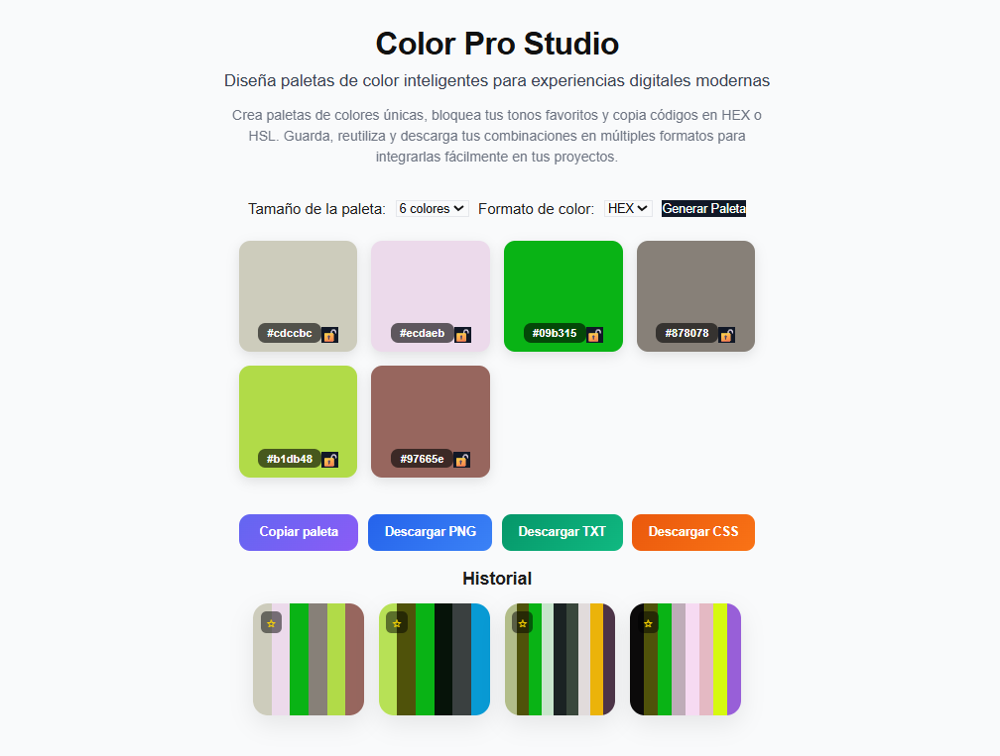

🎨 Color Pro Studio

Diseña paletas de color inteligentes para experiencias digitales.

Color Pro Studio es una aplicación web interactiva que permite generar paletas de colores aleatorias de forma rápida, visual e intuitiva. Está pensada para facilitar la creación de sistemas de color consistentes para diseño y desarrollo web.

Permite generar, bloquear, copiar y exportar paletas en múltiples formatos, mejorando el flujo de trabajo creativo.

  
---
🌐 Demo en vivo

👉 https://katherine-vasquez.github.io/proyectom1_katherinevasquez/

  
---
📸 Vista previa de la aplicación

  

  
---
🚀 Cómo usar la aplicación
Selecciona el tamaño de la paleta (6, 8 o 9 colores).  

Elige el formato de color (HEX o HSL).  

Haz clic en "Generar Paleta" para crear colores aleatorios.  

Visualiza cada color con su código HEX y HSL.  

Haz clic en un color para copiar su valor al portapapeles.  

Usa el botón de "Copiar paleta" para copiar toda la paleta y pegarla en cualquier editor, proyecto o herramienta de diseño.  

Bloquea los colores que quieras conservar usando 🔒.  

Las paletas se guardan automáticamente en el historial del navegador (localStorage).  

Desde el historial puedes reutilizar, marcar como favorita o eliminar paletas.  

Exporta tus paletas en formatos PNG, TXT o CSS.  

  
---

💻 Ejecución local

Si deseas ejecutar el proyecto en tu computadora:

Clona el repositorio:  

git clone https://github.com/katherine-vasquez/proyectom1_katherinevasquez.git  

Abre la carpeta del proyecto  

Abre el archivo index.html en tu navegador  

No se requieren dependencias adicionales.  

  
---

✨ Funcionalidades principales

-🎨 Generación de paletas de colores aleatorias  

-🔢 Selección de tamaño de paleta (6, 8 o 9 colores)  

-🎛️ Formato de color en HEX y HSL  

-📋 Visualización de cada color con su código HEX y HSL  

-🖱️ Copiar color individual al hacer clic  

-📋 Copiar paleta completa al portapapeles (para pegarla en cualquier herramienta o proyecto)  

-🔒 Bloqueo de colores individuales  

-💾 Guardado automático en localStorage  

⭐ Sistema de favoritos  

-🗑️ Eliminación de paletas  

-📤 Exportación en PNG, TXT y CSS  

-⚡ Interfaz interactiva con microanimaciones  

  
---

🧠 ¿Qué puede hacer el usuario?

El usuario puede generar combinaciones de colores automáticamente, ajustar la paleta bloqueando tonos específicos, copiar códigos de color para usarlos en otros proyectos, guardar sus combinaciones favoritas para reutilizarlas posteriormente y exportar sus paletas en diferentes formatos como imagen (PNG), texto (TXT) o variables CSS para desarrollo web.

  
---

📤 Exportación de paletas

El sistema permite exportar las paletas generadas de varias formas:

-📋 Copiar paleta completa al portapapeles

-💾 Descargar la paleta en diferentes formatos:

   PNG (imagen de la paleta)

   TXT (lista de códigos de color)

   CSS (variables listas para usar en proyectos)

Esto facilita el uso de las combinaciones de color en otros proyectos de diseño, desarrollo web o UI/UX.

  
---

🛠️ Tech Stack

-HTML5 → estructura semántica

-CSS3 → diseño, layout y animaciones

-JavaScript (Vanilla) → lógica e interacción

-LocalStorage → persistencia de datos

-Git / GitHub → control de versiones

-GitHub Pages → despliegue

  
---

⚙️ Funcionamiento técnico

-Generación de colores mediante valores HSL aleatorios

-Conversión automática de HSL a HEX

-Renderizado dinámico del DOM para cada paleta

-Gestión de estado con currentPalette

-Persistencia de datos en localStorage

-Sistema de historial limitado a las últimas 8 paletas

-Manejo de eventos para interacción del usuario

  
---

🧠 Conocimientos aplicados

-Manipulación del DOM

-Manejo de eventos en JavaScript

-Generación de valores aleatorios (HSL → HEX)

-Renderizado dinámico de componentes

-Persistencia con LocalStorage

-Diseño UI/UX interactivo

-Estructura de proyectos frontend

  
---

📂 Estructura del proyecto

proyectom1_katherinevasquez/

│── index.html

│── style.css

│── script.js

│── color-pro-studio-preview.png

│── README.md

  
---

🚀 Mejoras futuras (roadmap)

-🌙 Modo oscuro

-🔗 Compartir paletas por enlace

-🎨 Generación por armonías de color

-📱 Optimización mobile-first

-☁️ Exportación JSON avanzada

-🔌 Integración con herramientas de diseño (Figma)

  
---
📄 Documentación del proyecto (PDF):

https://github.com/katherine-vasquez/proyectom1_katherinevasquez/blob/main/DOCUMENTACION_PROYECTO_M1.pdf

  
---

👩‍💻 Autora

Katherine Vasquez
